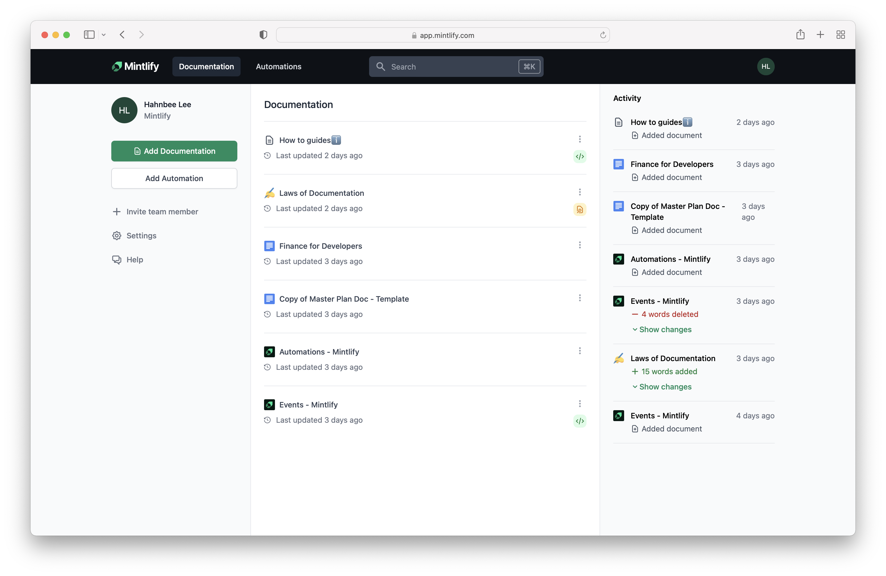
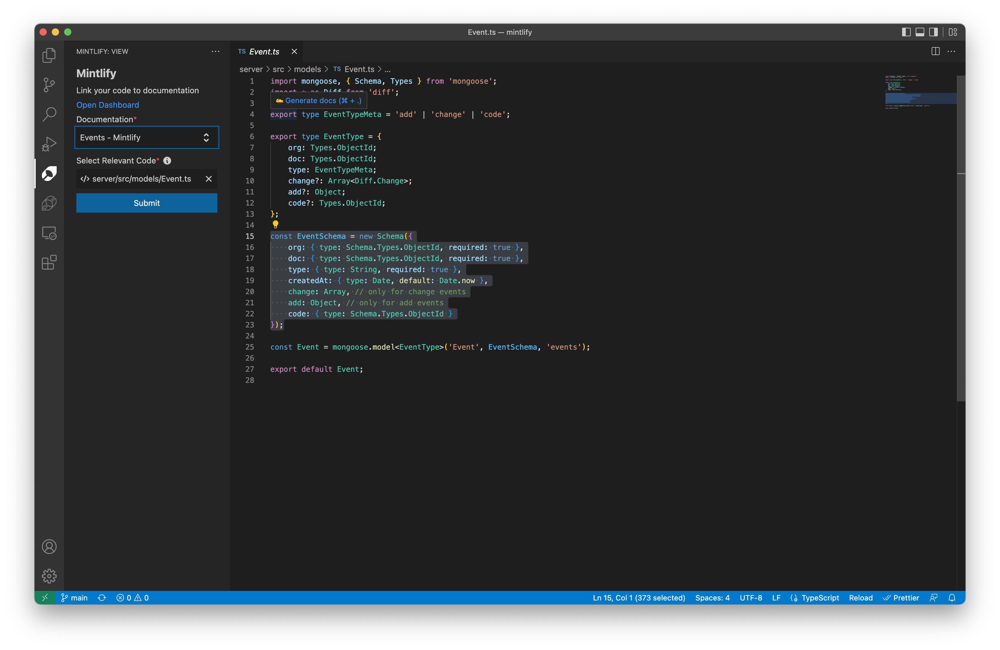
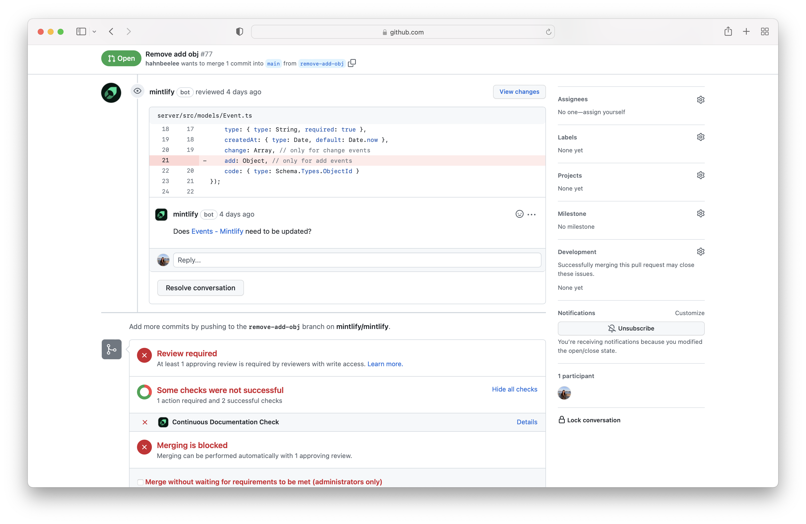

# 🌿 Mintlify

  

[Mintlify](https://www.mintlify.com/) helps teams easily track and manage documentation.

🚀 [Get Started](https://www.mintlify.com/create)

🎥 [Demo](https://www.loom.com/share/892d08e178144cd89b109f9396e4db98)

## Features

The goal of Mintlify is to increase visibility over documentation across your entire team so that you can easily maintain it. Mintlify allows you to:

### 🏡 Keep documentation in one place

Centralize your documentation into one searchable place

### 🔗 Create links between code and documentation

Implement a CI Check for documentation - connect documentation to code and receive alerts to update your documentation when the code changes

### 🔌 Integrations

We are currently integrated with:

- Notion
- Google Docs
- Confluence
- GitHub
- Slack

---

### More information

[Website](https://mintlify.com/)
[Twitter](https://twitter.com/mintlify)
[Discord](https://discord.gg/6W7GuYuxra)

_Built with 💚 by the Mintlify team_
